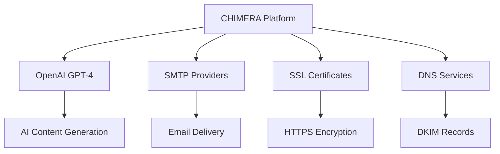
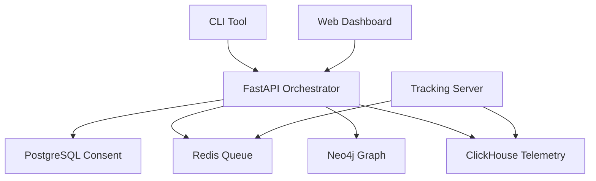

# 🏗️ CHIMERA System Architecture

## Cognitive Heuristic Intelligence for Multi-stage Engagement Research & Assessment

**Version:** 1.0.0-BLACKBOX
**Date:** December 2025

---

## 📋 Architecture Overview

CHIMERA implements a sophisticated multi-layered architecture designed to simulate nation-state APT capabilities while maintaining unbreakable ethical boundaries and privacy protections.

### Core Design Principles

1. **Ethical First**: Every component includes ethical validation
2. **Privacy by Design**: Data minimization and cryptographic protection
3. **Modular Architecture**: Independent services for scalability
4. **Defense in Depth**: Multiple security layers and kill switches

---

## 🏛️ High-Level Architecture

```
┌─────────────────────────────────────────────────────────────────────────┐
│                           CHIMERA ECOSYSTEM                             │
├─────────────────────────────────────────────────────────────────────────┤
│  ┌─────────────┐ ┌─────────────┐ ┌─────────────┐ ┌─────────────┐        │
│  │   USERS     │ │  RED TEAM   │ │  BLUE TEAM  │ │  COMPLIANCE │        │
│  │ (Targets)   │ │ (Operators) │ │ (Defenders) │ │ (Auditors)  │        │
│  └─────────────┘ └─────────────┘ └─────────────┘ └─────────────┘        │
├─────────────────────────────────────────────────────────────────────────┤
│                                                                         │
│  ┌─────────────────────────────────────────────────────────────────────┐ │
│  │                    CHIMERA PLATFORM                                │ │
│  ├─────────────────────────────────────────────────────────────────────┤ │
│  │  ┌─────────────┐ ┌─────────────┐ ┌─────────────┐ ┌─────────────┐   │ │
│  │  │ FASTAPI     │ │ GPT-4 AI    │ │ NEO4J       │ │ CLICKHOUSE  │   │ │
│  │  │ ORCHESTRATOR│ │ PRETEXT     │ │ IDENTITY    │ │ TELEMETRY   │   │ │
│  │  │             │ │ ENGINE      │ │ GRAPH       │ │ ENGINE      │   │ │
│  │  └─────────────┘ └─────────────┘ └─────────────┘ └─────────────┘   │ │
│  ├─────────────────────────────────────────────────────────────────────┤ │
│  │  ┌─────────────┐ ┌─────────────┐ ┌─────────────┐ ┌─────────────┐   │ │
│  │  │ NODE.JS     │ │ POSTFIX     │ │ REDIS       │ │ POSTGRESQL  │   │ │
│  │  │ TRACKING    │ │ SMTP        │ │ QUEUE       │ │ CONSENT     │   │ │
│  │  │ SERVER      │ │ DELIVERY    │ │ CACHE       │ │ DATABASE    │   │ │
│  │  └─────────────┘ └─────────────┘ └─────────────┘ └─────────────┘   │ │
│  └─────────────────────────────────────────────────────────────────────┘ │
├─────────────────────────────────────────────────────────────────────────┤
│  ┌─────────────┐ ┌─────────────┐ ┌─────────────┐ ┌─────────────┐        │
│  │ DOCKER      │ │ KUBERNETES  │ │ MONITORING  │ │ BACKUP      │        │
│  │ CONTAINERS  │ │ (OPTIONAL)  │ │ & LOGGING   │ │ & RECOVERY  │        │
│  └─────────────┘ └─────────────┘ └─────────────┘ └─────────────┘        │
└─────────────────────────────────────────────────────────────────────────┘
```

---

## 🔧 Core Components Deep Dive

### 1. FastAPI Orchestrator

**Purpose**: Central campaign lifecycle management and API gateway

**Key Features**:
- RESTful API with automatic OpenAPI documentation
- Asynchronous request handling with FastAPI
- JWT-based authentication and authorization
- Redis-based job queuing and distributed processing
- Real-time WebSocket monitoring capabilities

**Architecture**:
```
FastAPI Orchestrator
├── Campaign Manager (lifecycle)
├── Consent Validator (ethics)
├── Kill Switch (emergency)
├── Adaptive Engine (AI evolution)
└── API Gateway (routing)
```

**Data Flow**:
1. **Campaign Creation** → Consent validation → Queue execution
2. **Real-time Monitoring** → WebSocket updates → Dashboard
3. **Emergency Response** → Kill switch activation → Audit logging

### 2. GPT-4 Pretext Engine

**Purpose**: AI-powered adaptive content generation with ethical constraints

**Key Features**:
- OpenAI GPT-4 integration with safety filters
- Multi-layered ethical content validation
- Reinforcement learning for campaign adaptation
- Rate limiting and cost optimization
- Content safety classification

**Architecture**:
```
GPT-4 Pretext Engine
├── Pretext Generator (AI content)
├── Ethics Filter (safety validation)
├── Adaptation Engine (evolution)
└── Content Cache (performance)
```

**Ethical Layers**:
1. **Input Filtering**: Reject harmful prompts
2. **Output Validation**: Multi-pattern content checking
3. **Human Review**: Override capability for edge cases
4. **Audit Trail**: Complete generation logging

### 3. Neo4j Identity Graph

**Purpose**: Relationship mapping and OSINT correlation for targeting

**Key Features**:
- Graph database for complex relationship modeling
- Automated organizational structure generation
- Trust path analysis for impersonation vectors
- Privacy-preserving PII hashing
- Real-time graph traversal and analytics

**Architecture**:
```
Neo4j Identity Graph
├── Identity Mapper (CRUD operations)
├── Graph Builder (automated construction)
├── Trust Analyzer (relationship scoring)
└── Privacy Engine (data protection)
```

**Graph Schema**:
```cypher
// Core entities
(:Person)-[:REPORTS_TO]->(:Person)
(:Person)-[:COMMUNICATES_WITH]->(:Person)
(:Person)-[:VENDOR_RELATIONSHIP]->(:Organization)
(:Person)-[:TRUSTED_BY]->(:Person)

// Metadata
- trust_level: high/medium/low
- interaction_frequency: daily/weekly/monthly/occasional
- relationship_strength: calculated metric
```

### 4. ClickHouse Telemetry Engine

**Purpose**: High-velocity behavioral data collection and analytics

**Key Features**:
- Column-oriented database for analytical workloads
- Differential privacy with configurable epsilon
- K-anonymity checks for dataset protection
- Real-time anomaly detection
- Automated data retention and purging

**Architecture**:
```
ClickHouse Telemetry Engine
├── Telemetry Collector (data ingestion)
├── Privacy Filter (anonymization)
├── Analytics Engine (query processing)
├── Anomaly Detector (threat identification)
└── Retention Manager (data lifecycle)
```

**Privacy Architecture**:
- **Data Minimization**: Only necessary behavioral signals
- **Cryptographic Hashing**: Fingerprint anonymization
- **Differential Privacy**: Mathematical noise addition
- **Access Controls**: Query restrictions and auditing

### 5. Node.js Tracking Server

**Purpose**: Behavioral probe deployment and real-time telemetry collection

**Key Features**:
- Express.js server for high-performance tracking
- Comprehensive sandbox detection (7 methods)
- Honeypot reversal for automated analysis tools
- Canvas fingerprinting with privacy protections
- Geographic and device analytics

**Architecture**:
```
Node.js Tracking Server
├── Pixel Tracker (email opens)
├── Link Redirector (click tracking)
├── Sandbox Detector (environment analysis)
├── Honeypot Engine (deceptive responses)
└── Telemetry Pipeline (data export)
```

**Detection Methods**:
1. **Virtual Machine Detection**: VM artifacts and signatures
2. **Sandbox Artifacts**: Analysis tool fingerprints
3. **Automated Browsing**: Bot-like behavior patterns
4. **Security Monitoring**: Proxy and analysis tool detection
5. **Network Analysis**: Suspicious traffic patterns
6. **Timing Anomalies**: Impossible timing signatures
7. **Resource Limitations**: Sandbox resource constraints

---

## 🔐 Security Architecture

### Defense in Depth Layers

```
┌─────────────────────────────────────────────────────────┐
│                EXTERNAL SECURITY LAYER                  │
├─────────────────────────────────────────────────────────┤
│  ┌─────────────────────────────────────────────────────┐ │
│  │            NETWORK SECURITY                         │ │
│  │  • Firewall rules (UFW/iptables)                    │ │
│  │  • SSL/TLS encryption (Let's Encrypt)               │ │
│  │  • Rate limiting (nginx)                            │ │
│  │  • DDoS protection (Cloudflare)                     │ │
│  └─────────────────────────────────────────────────────┘ │
├─────────────────────────────────────────────────────────┤
│  ┌─────────────────────────────────────────────────────┐ │
│  │            APPLICATION SECURITY                      │ │
│  │  • Input validation (Pydantic)                       │ │
│  │  • Authentication (JWT)                             │ │
│  │  • Authorization (RBAC)                             │ │
│  │  • Session management                                │ │
│  └─────────────────────────────────────────────────────┘ │
├─────────────────────────────────────────────────────────┤
│  ┌─────────────────────────────────────────────────────┐ │
│  │            ETHICAL SECURITY                          │ │
│  │  • Consent validation (Three Gates)                 │ │
│  │  • Content filtering (Multi-layer)                 │ │
│  │  • Kill switches (Multiple triggers)                │ │
│  │  • Audit logging (Cryptographic proof)              │ │
│  └─────────────────────────────────────────────────────┘ │
├─────────────────────────────────────────────────────────┤
│  ┌─────────────────────────────────────────────────────┐ │
│  │            DATA PROTECTION                           │ │
│  │  • Encryption at rest (PostgreSQL)                  │ │
│  │  • Encryption in transit (TLS 1.3)                  │ │
│  │  • Data minimization                                 │ │
│  │  • Privacy by design                                 │ │
│  └─────────────────────────────────────────────────────┘ │
└─────────────────────────────────────────────────────────────────┘
```

### Kill Switch Mechanisms

**Multiple Emergency Termination Triggers**:

1. **Manual Activation**: Red team operator initiated
2. **Geographic Anomalies**: Non-whitelisted country access
3. **Time Boundaries**: Campaign expiration or timeouts
4. **Consent Revocation**: Participant withdrawal
5. **Escalation Detection**: Forwarded to legal/HR
6. **Anomaly Threshold**: Suspicious behavior patterns
7. **Ethical Violations**: Content filter triggers

---

## 🔄 Data Flow Architecture

### Campaign Execution Flow

```
1. CAMPAIGN CREATION
   User Request → Consent Validation → Campaign Approval → Queue

2. PRETEXT GENERATION
   Campaign Data → GPT-4 API → Ethics Filter → Content Approval → Storage

3. EMAIL DELIVERY
   Target List → SMTP Queue → DKIM Signing → Delivery → Bounce Handling

4. BEHAVIORAL TRACKING
   Email Open → Pixel Request → Sandbox Detection → Telemetry Collection
   Link Click → Redirect → Fingerprinting → Event Logging

5. ANALYTICS & ADAPTATION
   Raw Events → Privacy Filter → ClickHouse → Query Processing → Reports
   Performance Data → RL Algorithm → Strategy Adaptation → Next Iteration

6. EMERGENCY RESPONSE
   Anomaly Detection → Kill Switch → Campaign Termination → Incident Report
```

### Privacy Data Pipeline

```
RAW DATA → MINIMIZATION → ANONYMIZATION → AGGREGATION → ANALYSIS

1. Minimization: Only collect necessary behavioral signals
2. Anonymization: Hash PII, add differential privacy noise
3. Aggregation: Group data to prevent re-identification
4. Analysis: Statistical queries with privacy guarantees
```

---

## 📊 Scalability Architecture

### Horizontal Scaling Strategy

```
┌─────────────────────────────────────────────────────────────────────┐
│                          LOAD BALANCER                              │
├─────────────────────────────────────────────────────────────────────┤
│  ┌─────────────┐ ┌─────────────┐ ┌─────────────┐ ┌─────────────┐   │
│  │ ORCHESTRATOR │ │ ORCHESTRATOR │ │ ORCHESTRATOR │ │ ORCHESTRATOR │   │
│  │ INSTANCE 1  │ │ INSTANCE 2  │ │ INSTANCE 3  │ │ INSTANCE 4  │   │
│  └─────────────┘ └─────────────┘ └─────────────┘ └─────────────┘   │
├─────────────────────────────────────────────────────────────────────┤
│  ┌─────────────┐ ┌─────────────┐ ┌─────────────┐ ┌─────────────┐   │
│  │ TRACKING    │ │ TRACKING    │ │ TRACKING    │ │ TRACKING    │   │
│  │ SERVER 1    │ │ SERVER 2    │ │ SERVER 3    │ │ SERVER 4    │   │
│  └─────────────┘ └─────────────┘ └─────────────┘ └─────────────┘   │
├─────────────────────────────────────────────────────────────────────┤
│  ┌─────────────────────────────────────────────────────────────────┐ │
│  │                 SHARED INFRASTRUCTURE                           │ │
│  │  ┌─────────────┐ ┌─────────────┐ ┌─────────────┐ ┌─────────────┐ │ │
│  │  │ POSTGRESQL  │ │ NEO4J       │ │ CLICKHOUSE  │ │ REDIS       │ │ │
│  │  │ CLUSTER     │ │ CLUSTER     │ │ CLUSTER     │ │ CLUSTER     │ │ │
│  │  └─────────────┘ └─────────────┘ └─────────────┘ └─────────────┘ │ │
│  └─────────────────────────────────────────────────────────────────┘ │
└─────────────────────────────────────────────────────────────────────┘
```

### Performance Characteristics

| Component | Baseline | Scaled | Bottleneck |
|-----------|----------|--------|------------|
| **Orchestrator** | 100 req/s | 1000 req/s | Database connections |
| **Tracking Server** | 1000 req/s | 10000 req/s | Memory/CPU |
| **AI Generation** | 50 req/s | 500 req/s | OpenAI API limits |
| **Analytics** | 10 queries/s | 100 queries/s | ClickHouse resources |

---

## 🔗 Integration Architecture

### External Service Dependencies



### Internal Service Communication



---

## 📋 Deployment Architecture

### Docker Container Strategy

```yaml
# docker-compose.yml structure
version: '3.8'
services:
  orchestrator:     # FastAPI application
  tracking-server:  # Node.js tracking
  neo4j:           # Graph database
  clickhouse:      # Analytics database
  postgres:        # Consent database
  redis:           # Queue/cache
  postfix:         # Email delivery
```

### Environment Isolation

```
Production Environment
├── Frontend (nginx reverse proxy)
├── Application (Docker containers)
├── Database (Dedicated servers)
└── Monitoring (ELK stack)

Staging Environment
├── Mirror of production
└── Testing datasets

Development Environment
├── Local Docker setup
└── Mock external services
```

---

## 🔍 Monitoring & Observability

### Key Metrics

- **Campaign Success Rate**: Open rates, click rates, conversion rates
- **System Performance**: Response times, throughput, error rates
- **Privacy Compliance**: Data retention, anonymization effectiveness
- **Security Incidents**: Kill switch activations, anomaly detections

### Logging Architecture

```
Application Logs → Logstash → Elasticsearch → Kibana
├── FastAPI (structured JSON)
├── Tracking Server (JSON)
├── Database queries (SQL logs)
└── System metrics (Prometheus)
```

### Alerting Strategy

- **Critical**: Kill switch activations, consent violations
- **High**: System downtime, performance degradation
- **Medium**: Anomaly detections, resource warnings
- **Low**: Configuration changes, maintenance notifications

---

## 🚀 Future Architecture Evolution

### Phase 2 Enhancements (Q1 2026)
- **Microservices Migration**: Individual services for each component
- **Kubernetes Orchestration**: Cloud-native deployment
- **Multi-Cloud Support**: AWS/GCP/Azure compatibility
- **Advanced AI**: Custom models for pretext generation

### Phase 3 Enhancements (Q2 2026)
- **Global Distribution**: Multi-region deployment
- **Advanced Analytics**: Machine learning on telemetry data
- **API Gateway**: Enhanced security and rate limiting
- **Federated Learning**: Privacy-preserving model training

---

*"CHIMERA's architecture represents the most sophisticated ethical red team platform ever created, balancing cutting-edge offensive capabilities with uncompromising security and privacy protections."*


